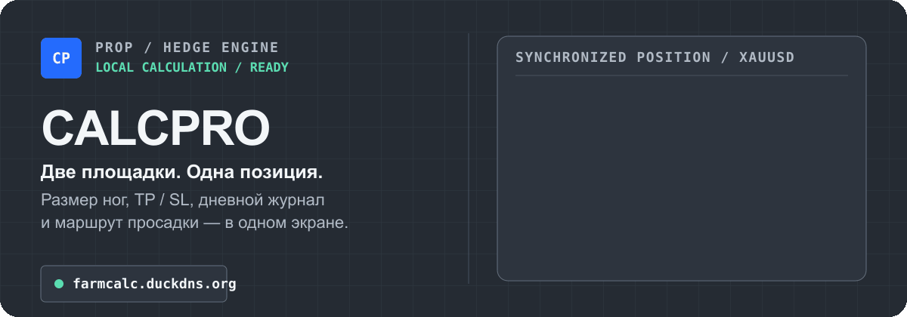
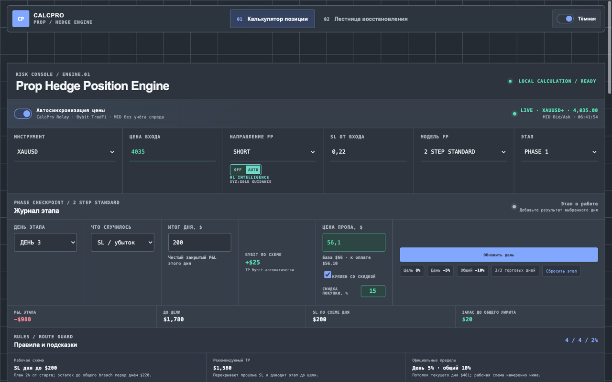
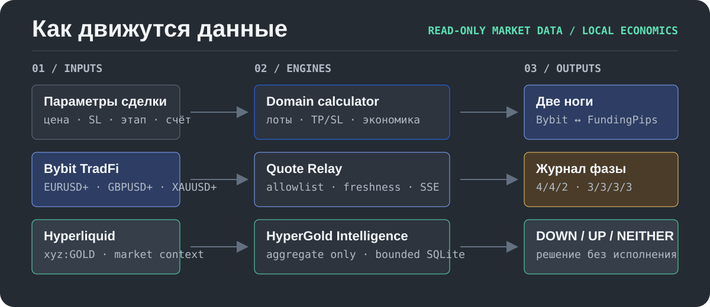

<p align="center">
  
</p>

<p align="center">
  <a href="https://farmcalc.duckdns.org/"><strong>Открыть калькулятор</strong></a>
  ·
  <a href="https://github.com/jack420xeppep-a11y/FundingPips-calc/actions/workflows/deploy.yml">CI/CD</a>
  ·
  <a href="./DESIGN.md">Design system</a>
  ·
  <a href="./assets/readme/hero.svg">Статический hero</a>
</p>

CalcPro — локальный расчётный движок и React-интерфейс для противоположных ног **FundingPips / Bybit**. Он рассчитывает объёмы, TP/SL и экономику полного цикла, сохраняет результаты дней внутри фазы и показывает рабочий маршрут просадки отдельно от официального предела.

> Это инструмент расчёта и наблюдения. Он не отправляет ордера и не скрывает комиссию или спред: fee-free и fee-aware режимы обозначены явно.

## Интерфейс — это доказательство

<p align="center">
  <a href="https://farmcalc.duckdns.org/">
    
  </a>
</p>

<p align="center"><sub>Реальный UI из headless browser-smoke; market values на снимке поданы локальными mock-сервисами.</sub></p>

В одном рабочем пространстве доступны:

- противоположные ноги Bybit и FundingPips с явными лотами, TP, SL и назначением каждой позиции;
- журнал Phase 1 / Phase 2 / Funded с отдельной записью фактических SL/TP и P&L для FundingPips и Bybit;
- рабочие маршруты **Standard `4 / 4 / 2%`** и **Flex `3 / 3 / 3 / 3%`**, не подменяющие официальные ограничения;
- эталонный маршрут Standard с возможностью заменить его фактическим исходом и восстановить одной кнопкой;
- funded TP для нуля и рабочая округлённая цель, учитывающие прошлый Bybit P&L, цену пропа, выбранный profit split и ожидаемый хедж-убыток;
- ручная цена пропа и скидка фактической покупки, включённые в чистую экономику;
- live-котировки `EURUSD+`, `GBPUSD+`, `XAUUSD+` и агрегированный `HL Intelligence` для золота;
- Quick Mode на мобильном, блокировка рассчитанного setup и копируемый тикет обеих ног.

## Как устроен CalcPro

<p align="center">
  
</p>

Расчёт позиции остаётся чистой локальной функцией и не зависит от доступности market feeds. Quote Relay один раз принимает публичный Bybit TradFi WebSocket и раздаёт валидированный same-origin SSE. HyperGold наблюдает только `xyz:GOLD`, хранит ограниченную приватную SQLite/WAL-базу и публикует в браузер только агрегированные состояния.

```text
параметры сделки ──→ domain calculator ──→ Bybit leg + FundingPips leg
Bybit TradFi ──────→ Quote Relay ─────────→ свежая MID-котировка
Hyperliquid GOLD ──→ HyperGold ───────────→ DOWN / UP / NEITHER
результат дня ─────→ phase ledger ─────────→ следующий SL / рекомендуемый TP
```

Адреса наблюдаемых кошельков и индивидуальные позиции не входят в публичный API. Если релей или intelligence недоступны, ручной калькулятор продолжает работать.

## Дисциплина фазы

CalcPro разделяет **правило проп-компании** и **рабочую схему с буфером**:

| Модель | Цели | Официально | Рабочий маршрут |
|---|---:|---:|---:|
| 2 Step Standard | Phase 1 `8%`, Phase 2 `5%` | день `5%`, общий `10%`, минимум 3 торговых дня | `4 / 4 / 2%` |
| 2 Step Flex | Phase 1 `10%`, Phase 2 `6%` | день `4%`, общий `12%` | `3 / 3 / 3 / 3%` |

Дневной официальный предел считается от большей из opening balance и opening equity; плавающий убыток также учитывается. Журнал CalcPro хранит введённый закрытый P&L, поэтому перед реальной постановкой SL требуется оставить место под spread, commission и floating equity.

Для новых evaluation-счетов от `$25K` интерфейс отдельно показывает порог **60% Profit Concentration**. Его превышение не проваливает evaluation, но меняет условия будущей выплаты Master Account.

## Быстрый старт

Требования: Node.js 22+, npm и современный браузер. Для полного browser-smoke нужен Google Chrome.

```bash
git clone git@github.com:jack420xeppep-a11y/FundingPips-calc.git
cd FundingPips-calc
npm ci
```

Запустите три процесса:

```bash
npm run relay
```

```bash
INTELLIGENCE_DB_PATH=/tmp/calcpro-intelligence.sqlite npm run intelligence
```

```bash
npm run dev
```

Vite покажет локальный адрес. Без relay и intelligence калькулятор остаётся доступен в ручном режиме.

## Проверка

```bash
npm test
npm run check:ops
npm run build
```

Полный браузерный сценарий запускается при работающих Vite и mock-сервисах:

```bash
node scripts/mock-calm-services.mjs
npm run test:browser -- http://127.0.0.1:5173/
```

Тесты покрывают sizing и TP/SL, экономику цикла, fee-aware расчёты, дневной ledger, Standard/Flex rules, optimizer, recovery ladder, контракты SSE, реконструкцию gold-эпизодов, lifecycle когорт, AUTO-стабилизацию, мобильный Quick Mode и production operations.

## Карта репозитория

| Область | Назначение |
|---|---|
| `src/domain/` | Чистые расчёты позиции, стратегии, phase ledger и trade ticket |
| `src/components/` | Execution workspace, журнал фазы, intelligence и recovery UI |
| `server/` | Bybit TradFi quote relay, allowlist, freshness и SSE |
| `intelligence/` | `xyz:GOLD`, агрегаты, SQLite/WAL, cohorts и probability engine |
| `ops/` | Ограниченный deployment, systemd, Caddy и production contracts |
| `scripts/` | Headless Chrome smoke и локальные mock-сервисы |
| `docs/hypergold/` | Источники, ограничения и roadmap intelligence-слоя |
| `DESIGN.md` | Linear Precision Fintech tokens, responsive и accessibility правила |

## Production и CI/CD

Каждый pull request и push в `main` проходит unit/integration tests, operations contracts, dependency audit и Vite build. Успешный push публикует frontend и два loopback-сервиса ограниченным deploy-ключом.

- Production: [farmcalc.duckdns.org](https://farmcalc.duckdns.org/)
- Workflow: [Quality and deploy](https://github.com/jack420xeppep-a11y/FundingPips-calc/actions/workflows/deploy.yml)
- Caddy: [`ops/farmcalc.caddy`](./ops/farmcalc.caddy)
- Restricted deploy: [`ops/fundingpips-calc-deploy`](./ops/fundingpips-calc-deploy)
- Services: [`calcpro-quote-relay.service`](./ops/calcpro-quote-relay.service) и [`calcpro-gold-intelligence.service`](./ops/calcpro-gold-intelligence.service)

Обычный rollback выполняется revert-коммитом в `main`, чтобы история оставалась проверяемой. Данные intelligence находятся вне release-каталога и не удаляются frontend-деплоем.

## Официальные референсы

- FundingPips: [2 Step Standard](https://help.fundingpips.com/hc/en-us/articles/34501809112081-2-Step-Standard)
- FundingPips: [2 Step Flex](https://help.fundingpips.com/hc/en-us/articles/47835196271249-2-Step-Flex)
- FundingPips: [Risk Per Trade Idea и Profit Concentration](https://help.fundingpips.com/hc/en-us/articles/48174287980177-Risk-Per-Trade-Idea)
- Hyperliquid: [WebSocket subscriptions](https://hyperliquid.gitbook.io/hyperliquid-docs/for-developers/api/websocket/subscriptions)
- Источники HyperGold, используемые при реализации: [`docs/hypergold/SOURCES.md`](./docs/hypergold/SOURCES.md)

## Границы

- CalcPro не связан с FundingPips, Bybit или Hyperliquid и не является их официальным продуктом.
- Приложение не исполняет сделки и не гарантирует прохождение evaluation или прибыль.
- Правила проп-компании могут меняться; перед торговлей сверяйте ограничения в личном кабинете и официальной документации.
- Live MID не включает spread. Фактические commissions, slippage и floating equity должны учитываться отдельно.
